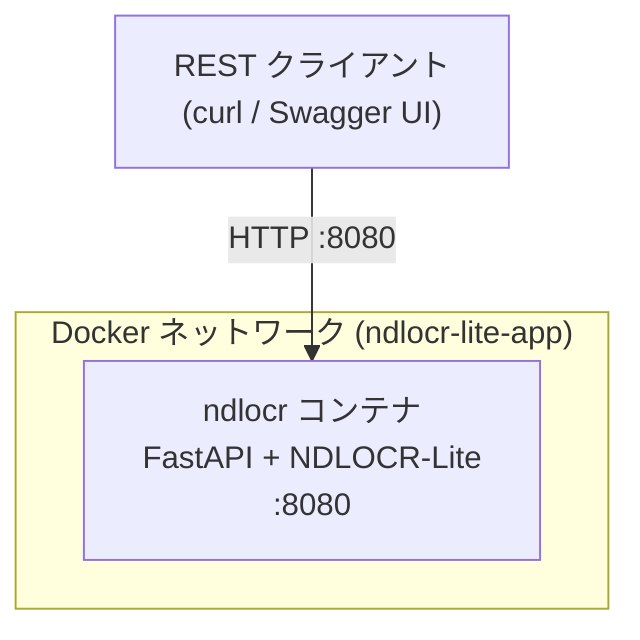
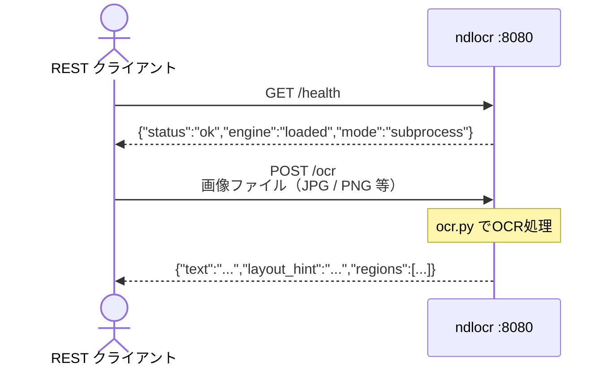
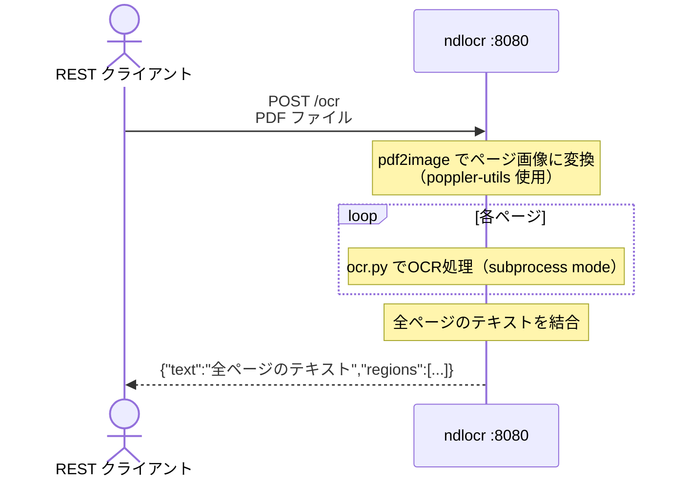

# 環境図・通信フロー — Phase 1

Phase 1 は ndlocr コンテナのみを起動して OCR 単体の動作を確認するフェーズ。
backend・frontend は存在しない。

---

## 環境図



---

## ポート対応表

| コンテナ | 内部ポート | 外部公開 | アクセス元 |
|---------|-----------|---------|-----------|
| ndlocr | 8080 | **8080** | REST クライアント（curl 等） |

---

## 通信フロー① 画像ファイルの OCR



---

## 通信フロー② PDF ファイルの OCR

PDF は PIL で直接開けないため、内部で画像変換してから OCR にかける。



---

## ndlocr 内部の処理モード

```mermaid
graph TD
    Start["リクエスト受信"]
    IsPdf{".pdf ?"}
    Pdf2Image["pdf2image でページ展開"]
    IsEngine{OcrEngine\nインポート可能?"}
    Direct["Direct モード\nOcrEngine.run()"]
    Sub["Subprocess モード\nocr.py を外部プロセスで実行"]
    Parse["出力 JSON / TXT をパース\n（contents の二重リストをフラット化）"]
    Response["レスポンス返却"]

    Start --> IsPdf
    IsPdf -- Yes --> Pdf2Image --> Sub
    IsPdf -- No --> IsEngine
    IsEngine -- Yes --> Direct --> Response
    IsEngine -- No --> Sub --> Parse --> Response
```

> **確認済み**: 現バージョンの NDLOCR-Lite では `OcrEngine` が直接 import できないため、
> 常に **Subprocess モード** で動作する。

---

## 確認コマンド

```powershell
# ヘルスチェック
curl.exe http://localhost:8080/health

# OCR（画像）
curl.exe -X POST http://localhost:8080/ocr -F "file=@C:\パス\画像.png"

# OCR（PDF）
curl.exe -X POST http://localhost:8080/ocr -F "file=@C:\パス\文書.pdf"

# Swagger UI
# http://localhost:8080/docs
```
