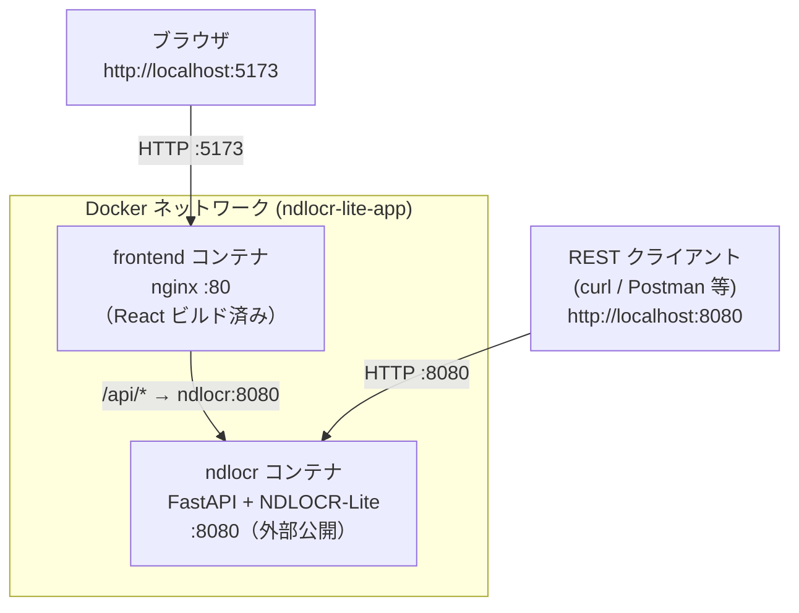
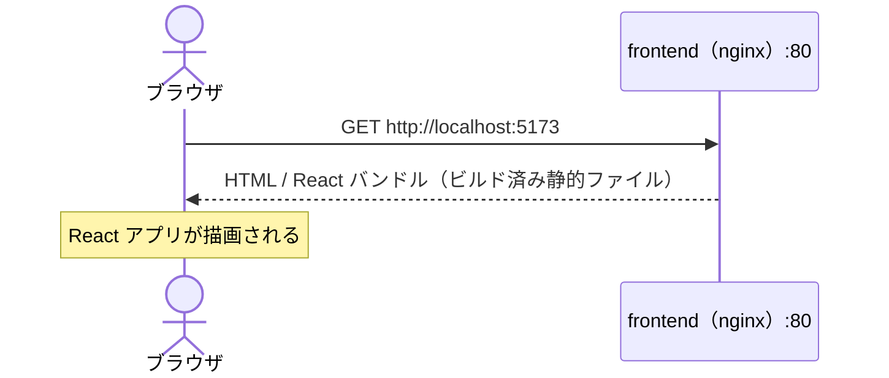
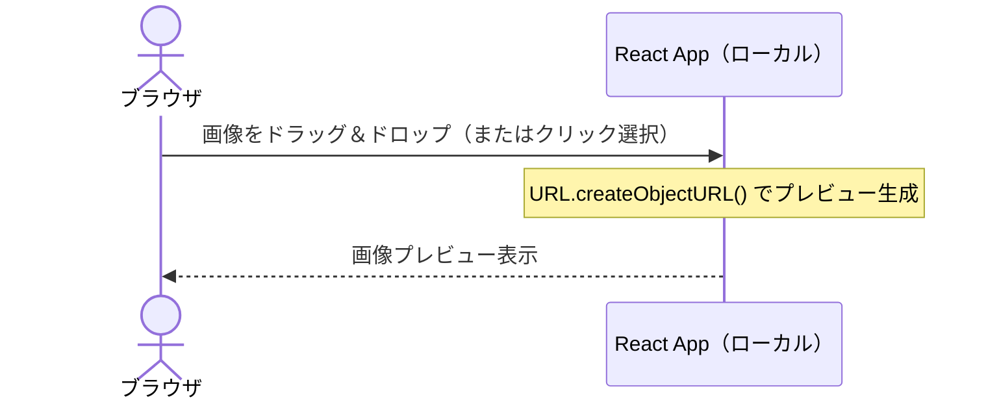
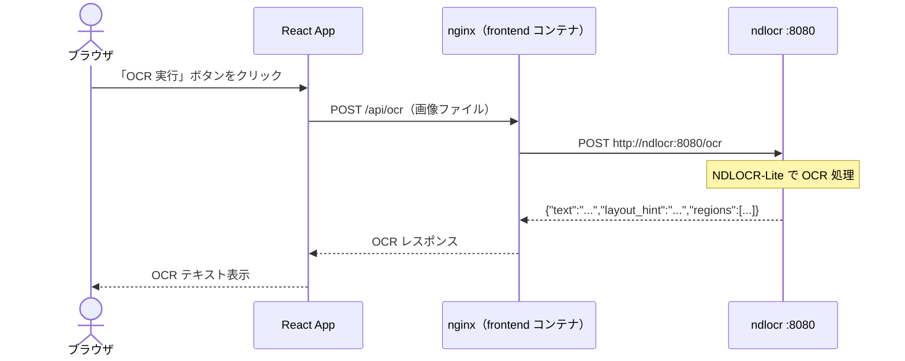
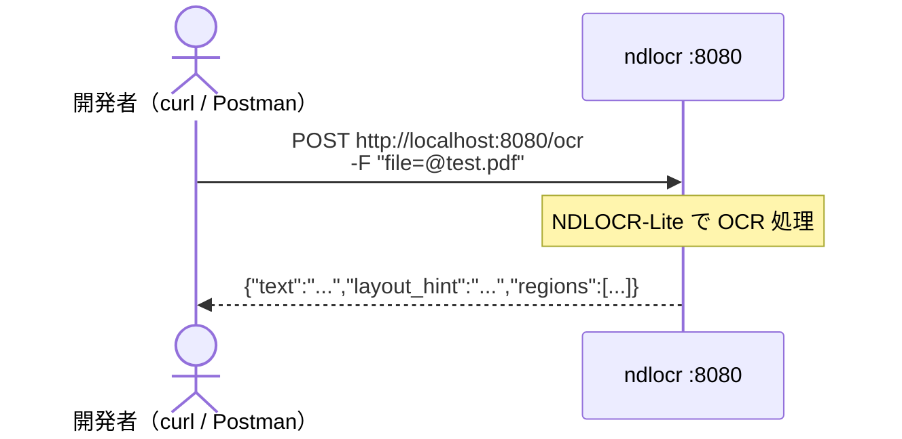

# 環境図・通信フロー — Phase 2

Phase 2 は frontend（nginx）と ndlocr の 2 コンテナを起動し、
ブラウザから直接 OCR を呼び出せることを確認するフェーズ。

---

## 環境図



---

## ポート対応表

| コンテナ     | 内部ポート | 外部公開     | アクセス元           |
| -------- | ----- | -------- | --------------- |
| frontend | 80    | **5173** | ブラウザ            |
| ndlocr   | 8080  | 8080     | Powershell等のCLI |

---

## 通信フロー① ページ読み込み



---

## 通信フロー② ファイル選択・プレビュー



> API は呼ばれない。ブラウザ内で完結する。

---

## 通信フロー③ OCR 実行



---

## 通信フロー④ CLI から ndlocr を直接キック



```bash
# ヘルスチェック
curl http://localhost:8080/health

# OCR 実行
curl -X POST http://localhost:8080/ocr -F "file=@サンプル.jpg"
```

---

## 起動コマンド

```bash
cd /mnt/c/Users/ohtsu/Documents/アプリ/ndlocr-lite-app
docker compose -f docker-compose.phase02.yml up --build
```

ブラウザで `http://localhost:5173` を開く。
