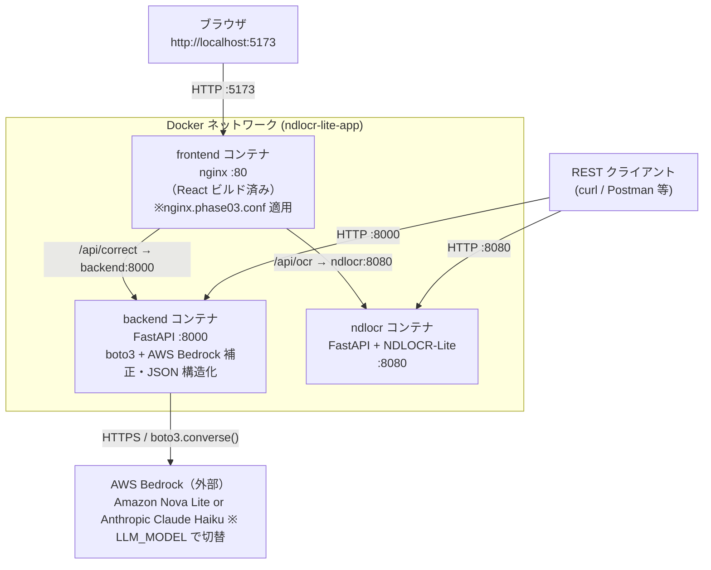
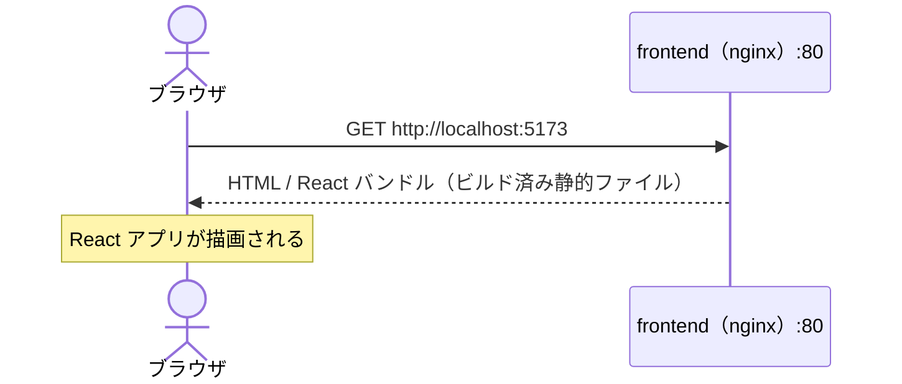
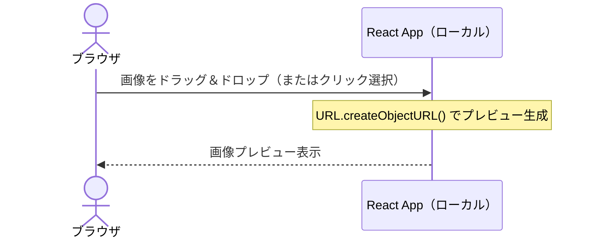
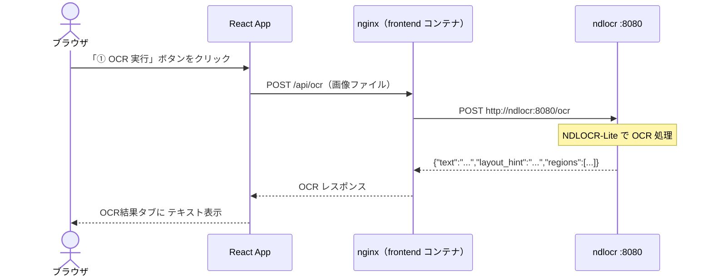
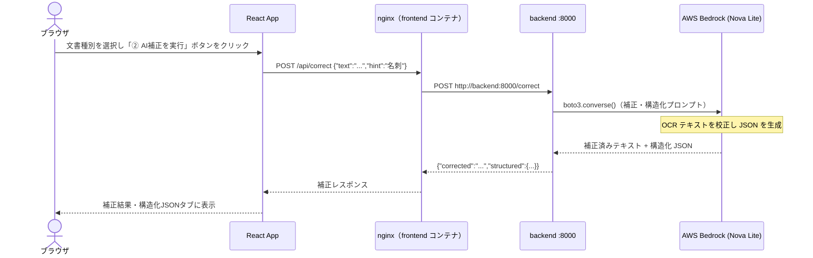
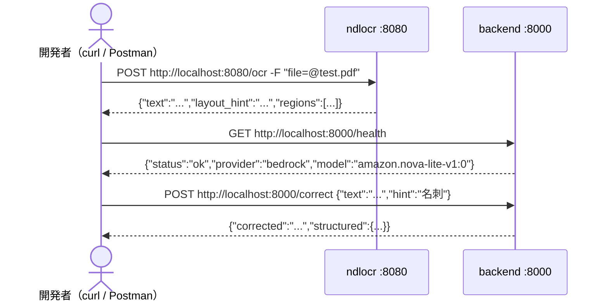

# 環境図・通信フロー — Phase 3

Phase 3 は frontend（nginx）・backend（FastAPI + boto3）・ndlocr の 3 コンテナを起動し、
OCR → LLM 補正・JSON 構造化までをブラウザから一貫して操作できることを確認するフェーズ。

nginx が `/api/ocr` と `/api/correct` を**経路ごとに振り分ける**のが Phase 2 との最大の違い。

---

## 環境図



---

## ポート対応表

| コンテナ     | 内部ポート | 外部公開 | アクセス元            |
| -------- | ----- | ---- | ---------------- |
| frontend | 80    | 5173 | ブラウザ             |
| backend  | 8000  | 8000 | curl / Postman 等 |
| ndlocr   | 8080  | 8080 | curl / Postman 等 |

---

## nginx 経路振り分け（Phase 3 の核心）

```
GET  /api/health    → backend:8000/health    （backend 死活確認）
POST /api/ocr       → ndlocr:8080/ocr        （OCR・LLM を通さない）
POST /api/correct   → backend:8000/correct   （LLM 補正・JSON 構造化）
```

> `/api/ocr` は ndlocr に直結するため、LLM コストが発生しない。
> 補正が必要な場合のみ `/api/correct` を呼び出す。

---

## 通信フロー① ページ読み込み



---

## 通信フロー② ファイル選択・プレビュー



> API は呼ばれない。ブラウザ内で完結する。

---

## 通信フロー③ OCR 実行

ndlocr に直結。backend・AWS Bedrock は経由しない。



---

## 通信フロー④ LLM 補正実行

OCR テキストを backend に送り、AWS Bedrock (Amazon Nova Lite) で補正・JSON 構造化する。



---

## 通信フロー⑤ CLI から各コンテナを直接キック



```bash
# ndlocr ヘルスチェック
curl http://localhost:8080/health

# OCR 実行（ndlocr 直接）
curl -X POST http://localhost:8080/ocr -F "file=@サンプル.jpg"

# backend ヘルスチェック
curl http://localhost:8000/health

# LLM 補正実行
curl -X POST http://localhost:8000/correct \
  -H "Content-Type: application/json" \
  -d '{"text":"山囲 太郎\n株式会社サンプル","hint":"名刺"}'
```

---

## UI フロー（ブラウザ操作）

```
┌──────────────────────────────────────┐
│  ドラッグ＆ドロップ / クリックで画像選択  │
└──────────────────────────────────────┘
         ↓
  [① OCR 実行]  ※ ndlocr 直結
         ↓
  [OCR結果] タブ自動表示
         ↓（任意）
  [文書種別選択▼] → [② AI補正を実行]  ※ backend → Bedrock
         ↓
  [補正結果] [構造化JSON] タブ追加・自動切り替え
```

**対応文書種別**: 名刺 / 請求書 / 見積書 / 納品書 / 領収書 / 契約書 / 帳票 / その他

---

## 起動コマンド

```bash
cd /mnt/c/Users/ohtsu/Documents/アプリ/ndlocr-lite-app
docker compose -f docker-compose.phase03.yml up --build -d
```

ブラウザで `http://localhost:5173` を開く。

---

## 対応文書種別・抽出フィールド一覧

フィールド定義は `backend/main.py` の `_examples_by_hint()` 関数に記載。
UI の選択肢は `frontend/src/App.jsx` の `HINT_OPTIONS` 配列で管理。

---

### 名刺

| フィールド | 説明 |
| --- | --- |
| `name` | 氏名 |
| `company` | 会社名 |
| `department` | 部署名 |
| `title` | 役職 |
| `postal_code` | 郵便番号 |
| `address` | 住所 |
| `tel` | 電話番号 |
| `fax` | FAX 番号 |
| `mobile` | 携帯番号 |
| `email` | メールアドレス |
| `website` | Web サイト URL |

---

### 請求書

| フィールド | 説明 |
| --- | --- |
| `document_type` | 文書種別（"請求書"） |
| `invoice_number` | 請求書番号 |
| `date` | 発行日 |
| `due_date` | 支払期限 |
| `issuer` | 発行者（請求元） |
| `recipient` | 宛先（請求先） |
| `items[]` | 明細行（`name`, `quantity`, `unit_price`, `amount`） |
| `subtotal` | 小計 |
| `tax_rate` | 消費税率（%） |
| `tax_amount` | 消費税額 |
| `total_amount` | 合計金額 |
| `currency` | 通貨（"JPY"） |
| `bank_name` | 振込先銀行名 |
| `bank_account` | 口座情報 |
| `notes` | 備考 |

---

### 見積書

| フィールド | 説明 |
| --- | --- |
| `document_type` | 文書種別（"見積書"） |
| `quote_number` | 見積番号 |
| `date` | 発行日 |
| `valid_until` | 有効期限 |
| `issuer` | 発行者（見積元） |
| `recipient` | 宛先 |
| `items[]` | 明細行（`name`, `quantity`, `unit_price`, `amount`） |
| `subtotal` | 小計 |
| `tax_rate` | 消費税率（%） |
| `tax_amount` | 消費税額 |
| `total_amount` | 合計金額 |
| `currency` | 通貨（"JPY"） |
| `notes` | 備考 |

---

### 納品書

| フィールド | 説明 |
| --- | --- |
| `document_type` | 文書種別（"納品書"） |
| `delivery_number` | 納品番号 |
| `date` | 納品日 |
| `issuer` | 納品元 |
| `recipient` | 納品先 |
| `items[]` | 明細行（`name`, `quantity`, `unit`, `unit_price`, `amount`） |
| `total_amount` | 合計金額 |
| `currency` | 通貨（"JPY"） |
| `notes` | 備考 |

---

### 領収書

| フィールド | 説明 |
| --- | --- |
| `document_type` | 文書種別（"領収書"） |
| `receipt_number` | 領収書番号 |
| `date` | 発行日 |
| `issuer` | 発行者（領収元） |
| `recipient` | 宛名 |
| `amount` | 領収金額 |
| `tax_rate` | 消費税率（%） |
| `tax_amount` | 消費税額 |
| `purpose` | 但し書き |
| `payment_method` | 支払方法 |
| `currency` | 通貨（"JPY"） |

---

### 契約書

| フィールド | 説明 |
| --- | --- |
| `document_type` | 文書種別（"契約書"） |
| `title` | 契約書タイトル |
| `contract_number` | 契約番号 |
| `date` | 契約日 |
| `effective_date` | 契約開始日 |
| `expiry_date` | 契約終了日 |
| `party_a` | 甲（`role`, `company`, `representative`, `address`） |
| `party_b` | 乙（`role`, `company`, `representative`, `address`） |
| `amount` | 委託料・契約金額 |
| `payment_terms` | 支払条件 |
| `currency` | 通貨（"JPY"） |
| `governing_law` | 準拠法 |
| `notes` | 備考 |

---

### 帳票

汎用帳票（納品書・発注書・受注書など）の簡易フォーマット。

| フィールド | 説明 |
| --- | --- |
| `document_type` | 文書種別（"帳票"） |
| `title` | 帳票タイトル（例: "納品書"） |
| `date` | 日付 |
| `document_number` | 帳票番号 |
| `issuer` | 発行者 |
| `recipient` | 宛先 |
| `items[]` | 明細行（`name`, `quantity`, `unit`） |
| `total_amount` | 合計金額 |
| `notes` | 備考 |

---

### その他

上記以外の文書種別。LLM が文書内容を自由に解釈してサマリを生成する。

| フィールド | 説明 |
| --- | --- |
| `summary` | 文書の概要（一文） |

> より詳細なフィールドが必要な場合は `backend/main.py` の `_examples_by_hint()` に文書種別と出力例を追記することで拡張できる。

---

## Phase 間の比較

| 項目                | Phase 1       | Phase 2           | Phase 3                                     |
| ----------------- | ------------- | ----------------- | ------------------------------------------- |
| 起動コンテナ            | ndlocr のみ     | frontend + ndlocr | frontend + backend + ndlocr                 |
| OCR 経路            | CLI 直接        | nginx → ndlocr    | nginx → ndlocr（変わらず）                        |
| LLM 補正            | なし            | なし                | nginx → backend → AWS Bedrock               |
| 使用 LLM            | —             | —                 | Amazon Nova Lite / Anthropic Claude（切替可）    |
| AWS 認証情報 必要       | 不要            | 不要                | **必要**（ACCESS_KEY / SECRET_KEY）             |
| WebUI             | —             | OCR のみ            | OCR + AI補正（タブ切り替え）                         |
| REST API          | OCR のみ        | OCR のみ            | OCR（ndlocr直接）+ AI補正（backend / nginx経由）      |
| 対応文書種別            | —             | —                 | 8種別（名刺・請求書・見積書・納品書・領収書・契約書・帳票・その他）         |
| 確認済み              | ✅            | ✅                 | ✅                                           |
